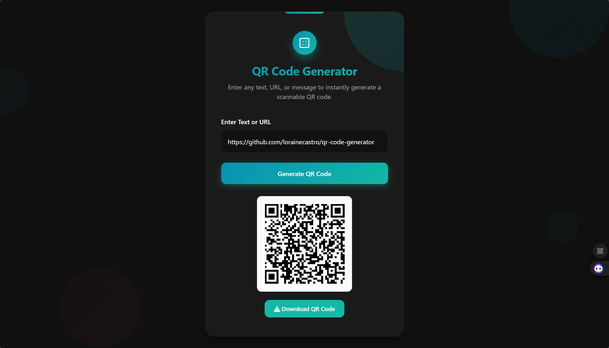

# QR Code Generator

A client-side QR Code Generator built entirely with pure HTML, CSS, and JavaScript. Enter any text, URL, or message to instantly generate a high-quality, scannable QR code with easy PNG download.

[**Try the Live Demo**](https://lorainecastro.github.io/qr-code-generator/)

## Features
- **Instant QR Code Generation** — Create QR codes immediately as you enter text or URLs
- **Downloadable PNG** — Export as PNG with extra padding for better scanning
- **Modern Dark Design** — Turquoise/teal gradients, floating background animations, parallax effects, and hover interactions
- **Notifications** — Success and error toasts for better user feedback.
- **Responsive Layout** — Perfectly adapts to desktop and mobile screens
- **High Error Correction** — Uses QRCode.js with High correction level for reliable scanning.

## Libraries Used
- [**QRCode.js**](https://github.com/davidshimjs/qrcodejs) – Lightweight QR code generation
- [**Font Awesome**](https://fontawesome.com) – Icons for download button

All loaded via CDN – no installation required.